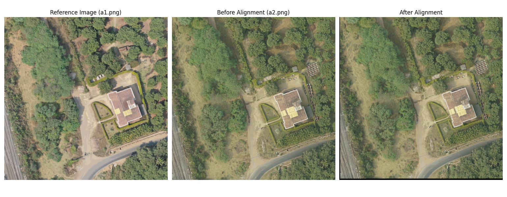
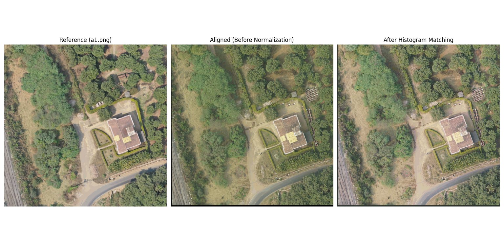
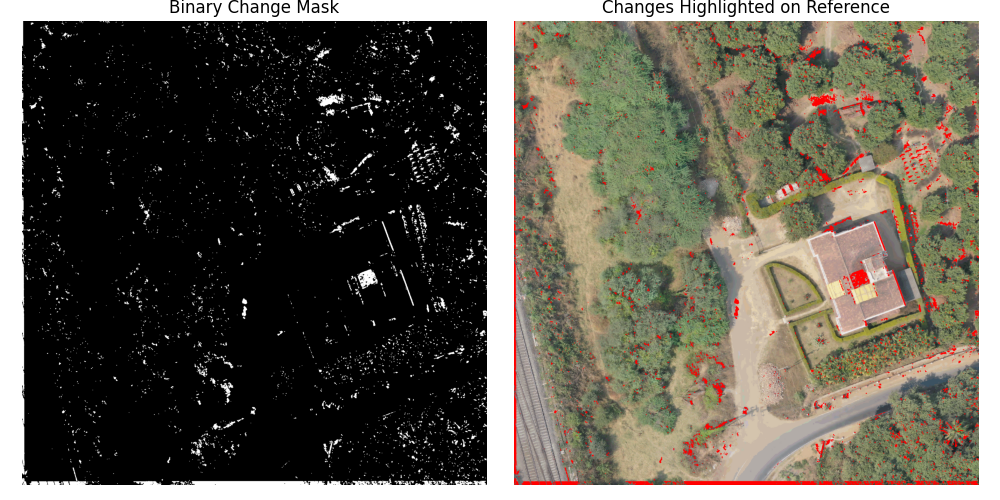

# Satellite Image Change Detection with ECC Alignment & Histogram Normalization
A deep learning framework for semantic change detection using pairs of ortho-rectified images. Supports dataset preparation from annotated reference and normalized image pairs, automatic mask generation, and 6-channel UNet-based training for multi-class change segmentation.

This project demonstrates a complete pipeline for **semantic change detection** between two **ortho-rectified satellite images** captured under different environmental conditions.

It leverages:
- **ECC-based image alignment**
- **Histogram matching for normalization**
- **Change detection through differencing and thresholding**

---

## 📸 Example Workflow

1. **Input Images**: `a1.png` (reference) and `a2.png` (target)
2. **ECC Alignment**: Aligns `a2.png` to `a1.png`
3. **Histogram Matching**: Normalizes lighting/environment differences
4. **Change Detection**: Outputs binary mask highlighting areas of change

## 📊 Sample Outputs
<div align="center">

<table>
  <tr>
    <td align="center">
      <br/>
      <b>ECC Aligned Image</b>
    </td>
    <td align="center">
      <br/>
      <b>Histogram Normalized</b>
    </td>
  </tr>
  <tr>
    <td colspan="2" align="center">
      <br/>
      <b>Change Detection Mask</b>
    </td>
  </tr>
</table>

</div>

---

## 🧠 Key Features

- 📐 **ECC-Based Image Registration**: Uses OpenCV’s `findTransformECC` for precise homography-based alignment.
- 🌈 **Histogram Matching**: Compensates for lighting or weather differences using `skimage`.
- 🧽 **Morphological Cleaning**: Removes small artifacts from change maps.
- 🔴 **Overlay Visualization**: Highlights changed regions in red on the reference image.

---

## 🧰 Dependencies

- `opencv-python`
- `numpy`
- `matplotlib`
- `scikit-image`

Install via:

```bash
pip install opencv-python numpy matplotlib scikit-image
